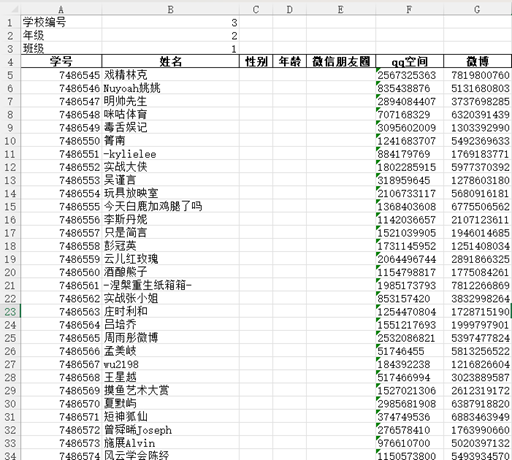
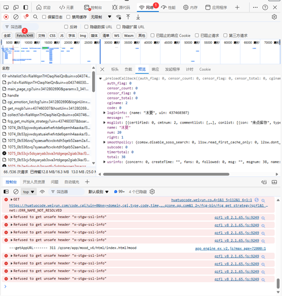
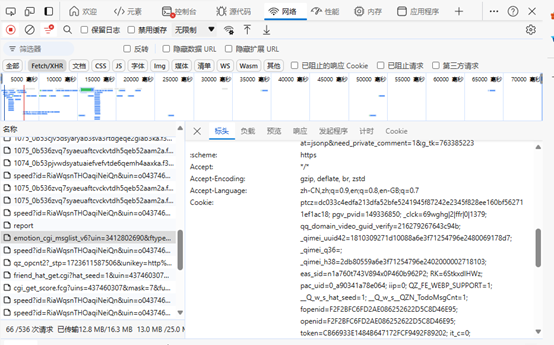
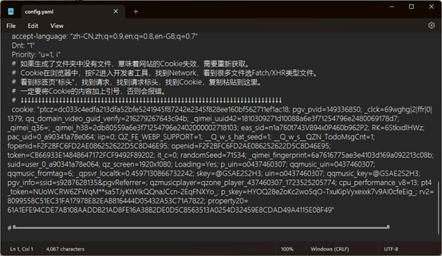
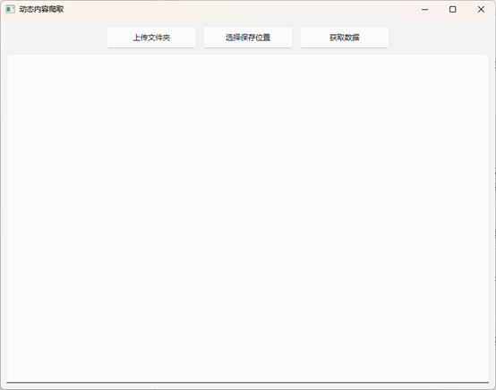

# 动态内容爬取操作文档

## 简介

欢迎使用动态内容爬取工具！本工具提供了一个简洁的图形用户界面（GUI），用于从指定文件夹中的Excel文件中提取学生信息，并根据学生的微博和QQ空间ID抓取相关的动态内容。抓取到的内容将被保存到用户选择的文件夹中。本工具支持任务进度实时显示，并允许用户随时停止任务。

## 表格说明

程序接受的表格形式如图所示：

  

根据需要修改值，不能修改标题，否则程序将无法读取。

## 系统要求

- **操作系统**: Windows 11
- **Python 版本**: Python 3.11 或更高

## 操作步骤

### 初始化配置Cookie

1. 打开网页浏览器，进入QQ空间登录后，进入任意一个好友的空间，按下 `F12` 进入浏览器控制台，找到“网络”-“Fetch/XHR”。
  

2. 点击上方网页中导航栏的“说说”进入说说列表。
  

3. 在控制台中的“Fetch/XHR”中找到文件“emotion_cgi_msglist_v6?uin= *”，如果没有尝试按 `F5` 刷新。
4. 单击此文件，在右侧标头中找到Cookie，将Cookie的值复制。
  
5. 用记事本打开本地的 `config.yaml` 文件，将原来的Cookie值替换掉。
  
> 微博同理。

### 启动程序

双击启动 `run.exe` 可执行文件，或在命令行中运行以下命令启动程序：  

```shell
python run.py
```

启动后，您将看到主窗口，界面布局如下：
  
- **上传文件夹** 按钮：选择需要处理的包含Excel文件的文件夹。
- **选择保存位置** 按钮：选择保存抓取结果的文件夹。
- **获取数据** 按钮：开始或停止数据抓取任务。
- **文本显示框**：显示任务的进度、结果以及可能的错误信息。
- **进度条**：显示任务的处理进度。

### 上传文件夹

1. 点击“上传文件夹”按钮。
2. 在弹出的文件选择对话框中，选择包含要处理的Excel文件的文件夹，可包含多个表格。
3. 选择后，系统会在文本显示框中显示已选择的文件夹路径。

### 选择保存位置

1. 点击“选择保存位置”按钮。
2. 在弹出的文件选择对话框中，选择用于保存抓取结果的文件夹。
3. 选择后，系统会在文本显示框中显示已选择的保存位置路径，程序生成的文件将保存在此目录下。

### 获取数据

1. 在上传文件夹和选择保存位置后，点击“获取数据”按钮开始数据抓取任务。
2. 程序将逐一处理所选文件夹中的每个Excel文件。对于每个文件，系统会：
   - 提取文件中的头信息和学生数据。
   - 根据学生的微博和QQ空间ID，抓取相关的动态内容。
   - 将抓取到的内容保存到指定的文件夹中，并在文本显示框中显示进度和结果。
3. 如果需要在任务执行过程中终止任务，您可以再次点击“获取数据”按钮，此时按钮文字会变为“停止”。点击后，程序将尝试安全地终止当前任务。
4. 当任务完成或被手动停止时，进度条将停止显示，并在文本显示框中显示任务完成或终止的状态。

## 任务进度和结果查看

- **进度条**：显示当前任务的总体进度。
- **文本显示框**：实时显示当前正在处理的文件、抓取的动态内容，以及任何可能出现的错误信息。
- **任务完成**：任务完成时，文本显示框会显示总耗时，并标注任务已完成。

## 任务停止

如果需要手动停止任务，点击“获取数据”按钮，程序会安全地终止当前任务，并在文本显示框中提示用户任务已终止。

## 可能遇到的问题

- **未选择文件夹或保存位置**：如果未选择文件夹或保存位置，程序会弹出错误提示，要求用户先进行选择。
- **文件处理错误**：如果在处理文件时出现错误，程序会在文本显示框中显示错误信息，但不会终止整个任务，您可以根据提示进行处理。
- **抓取失败重试**：对于抓取微博或QQ空间动态时失败的情况，程序会自动进行最多5次重试，并在每次重试前随机延迟一定时间。
